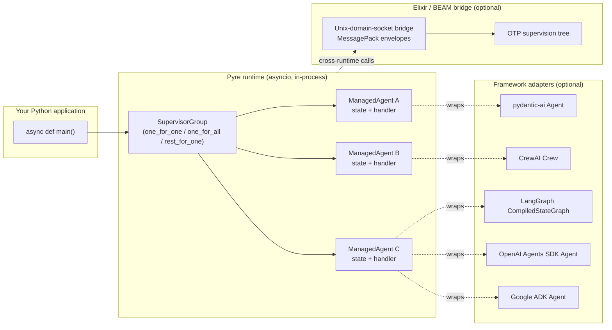

# Pyre

**The supervisor for your Python agents — whatever framework you picked.**

You already chose an agent framework — pydantic-ai, CrewAI, LangGraph,
OpenAI Agents SDK, Google ADK. Each handles prompting, tools, and state
well on its own. None of them handle *running many of them together*:
isolating a crash in one crew from the others, restarting a flaky agent
without losing its conversation, draining safely on shutdown, mixing
agents from different frameworks in one system.

Pyre is the orchestration layer that sits above all of them. One
`supervise()` call per agent, regardless of framework. BEAM-style
supervision semantics. Your agent code is unchanged.

```python
# Three frameworks, one supervised system.
planner   = await supervise_pydantic_ai(planner_agent,   system=system, name="planner")
research  = await supervise_crewai   (research_factory,  system=system, name="research")
writer    = await supervise_adk      (writer_agent,      system=system, name="writer")

# They run concurrently. If the CrewAI crew crashes, the pydantic-ai
# planner and ADK writer keep going. The crew restarts with its
# last-committed state intact.
```

## Why Pyre

Once you have more than one agent in production, the questions stop
being about prompting and start being about orchestration: what happens
when one crashes? How do you run hundreds concurrently without them
starving each other? How do you shut down cleanly? How do you mix
frameworks without wrapping every call in try/except?

Pyre solves those questions once, at the supervisor layer:

- **Framework-agnostic orchestration**: five adapters ship today (pydantic-ai, CrewAI, LangGraph, OpenAI Agents SDK, Google ADK). Mix them freely inside one supervision tree.
- **True fault isolation**: one agent's crash can't kill the others. Every supervised agent has its own process identity; supervisors apply `one_for_one` / `one_for_all` / `rest_for_one` policies you already know from OTP.
- **Automatic recovery with state**: opt in to `preserve_state_on_restart` and the last-committed state (conversation history, session pointers, counters) is kept across restarts. No custom checkpointer per framework.
- **Preemptive-style fair scheduling**: one slow agent can't starve the others, even under asyncio.
- **Graceful shutdown**: `stop_system(drain_timeout_s=...)` rejects new calls, drains in-flight handlers, and exits cleanly. No orphaned runs.
- **Python-first API**: async handlers, pydantic state models, familiar patterns. The Elixir/BEAM bridge is opt-in for very-high-concurrency deployments.

## Architecture

Your application code runs in a normal Python process. Each Pyre agent is
a small state-plus-handler bundle living inside that process,
coordinated by an asyncio-based supervisor. Crashes inside a handler
bubble through Pyre's supervision tree (restart per policy, preserve
last-committed state if you asked) rather than through your call stack.



For most users, the Elixir/BEAM bridge is an optional component; the
in-process Python runtime alone delivers preemptive-style fair
scheduling, supervision, and crash recovery. Cross-runtime calls are
opt-in — they're what unlocks the validated `~3.8KB` BEAM-side process
footprint for very-high-concurrency deployments, but a single-process
Python deployment works as-is.

## Cost model

Per-agent marginal memory (added for each new supervised agent), on top of a
fixed ~50MB Python interpreter and ~30MB Elixir node base:

| Model | Marginal per-agent memory | Isolation | Supervision |
|-------|---------------------------|-----------|-------------|
| Python multiprocessing | 10-50MB | ✓ | Manual |
| Python threading | 1-8MB | ✗ (GIL) | Manual |
| Python asyncio | ~KB | ✗ (shared heap) | Manual |
| Pyre | ~3.8KB BEAM process + ~1-2KB Python handler ≈ ~5KB | ✓ | Built-in |

10,000 active agents is ~80MB of fixed runtime plus ~50MB of per-agent overhead
— well under a 1GB container. Bridge throughput is ~43k messages/sec per
connection with 0.11ms median latency (p99: 0.20ms) on the validation rig, so
the bridge is not the bottleneck for any realistic LLM-bound workload.

## Status

- Phases 1–4 (bridge protocol, agent lifecycle, supervision trees, packaging): complete
- Adapters: [pydantic-ai](src/pyre_agents/adapters/pydantic_ai.py), [CrewAI](src/pyre_agents/adapters/crewai.py), [LangGraph](src/pyre_agents/adapters/langgraph.py), [OpenAI Agents SDK](src/pyre_agents/adapters/openai_agents.py), [Google ADK](src/pyre_agents/adapters/google_adk.py)
- Current focus: Phase 5 (advanced features, more adapters)

## Requirements

- Python 3.12+
- [`uv`](https://github.com/astral-sh/uv)
- Elixir + Mix (only required for cross-runtime tests and the Elixir bridge; not needed for the in-process Python runtime or any adapter)

## Quickstart: pick your framework, wrap it in one line

Install Pyre with the extras for whatever you use:

```bash
uv add 'pyre-agents[pydantic-ai,crewai,langgraph,openai-agents,google-adk]'
```

Every adapter has the same shape: `supervise(agent_or_factory, system=..., name=...)` returns a handle you can call concurrently. Here's pydantic-ai:

```python
import asyncio
from pydantic_ai import Agent as PydanticAgent
from pyre_agents import Pyre
from pyre_agents.adapters.pydantic_ai import supervise


async def main() -> None:
    pyd_agent = PydanticAgent("openai:gpt-4o", system_prompt="be brief")
    system = await Pyre.start()
    try:
        chat = await supervise(pyd_agent, system=system, name="chat")
        print(await chat.run("hi"))
        print(await chat.run("what did I just say?"))  # history threaded automatically
    finally:
        await system.stop_system()


asyncio.run(main())
```

Swap `pyre_agents.adapters.pydantic_ai` for `.crewai`, `.langgraph`, `.openai_agents`, or `.google_adk` to get the same supervision semantics over a different framework. See the full adapter table in [Framework adapters](#framework-adapters) below, and one happy-path example per adapter in [`examples/usage/`](examples/usage/).

## See it in 30 seconds

One file, no external deps, shows the punchline:

```bash
uv run python examples/without_vs_with_pyre.py
```

Same scenario — three conversation turns with a tool that crashes on the
middle one — runs twice: once in raw asyncio (history ends corrupt with a
dangling user message), once wrapped in Pyre (history stays clean because
state is only committed after a handler returns).

## A realistic multi-agent product

`examples/research_assistant.py` is a full multi-agent workflow built on
Pyre + the pydantic-ai adapter — three perspective agents (technical,
business, risk) running concurrently, a synthesizer combining their
outputs, and one agent whose provider deliberately crashes mid-run. Pyre
isolates the failure, preserves the surviving agents' work, restarts the
crashed agent with its conversation history intact, and the workflow
completes.

```bash
# Deterministic — no API key needed, fixed crash-and-recover scenario:
uv run --with 'pydantic-ai>=1.0' python examples/research_assistant.py

# Live against a real model (requires OPENAI_API_KEY):
uv run --with 'pydantic-ai>=1.0' python examples/research_assistant.py --live
```

`--model` picks the pydantic-ai provider string (default
`openai:gpt-4o-mini`); `--topic` customizes the prompt.

## Framework adapters

Pyre doesn't compete with pydantic-ai, CrewAI, LangGraph, OpenAI Agents
SDK, or Google ADK — it orchestrates them. Each adapter is a thin wrapper
that takes a native agent (or factory) and returns a supervised handle.
Agent code is not modified; you keep every feature the framework gives
you — tools, handoffs, checkpointers, sessions — and gain supervision,
concurrency isolation, and crash recovery on top.

- **pydantic-ai** (`pyre-agents[pydantic-ai]`) — `pyre_agents.adapters.pydantic_ai.supervise(agent, system=..., name=...)` returns a supervised handle whose `.run(prompt)` threads `message_history` through a Pyre process. Crashes that escape pydantic-ai's own error handling trigger a restart that keeps the last-committed history intact.
- **CrewAI** (`pyre-agents[crewai]`) — `pyre_agents.adapters.crewai.supervise(crew_factory, system=..., name=...)` returns a supervised handle whose `.kickoff(inputs)` runs on a fresh `Crew` instance from the factory. One crew's crash cannot take down another supervised crew. Sync `kickoff()` is offloaded to a thread so concurrency is real.
- **LangGraph** (`pyre-agents[langgraph]`) — `pyre_agents.adapters.langgraph.supervise(graph_factory, system=..., name=...)` returns a supervised handle whose `.invoke(input, config=...)` runs a fresh compiled graph on each call. LangGraph already has durable execution via Checkpointer; the adapter adds **isolation between concurrent graph runs** on top of that.
- **OpenAI Agents SDK** (`pyre-agents[openai-agents]`) — `pyre_agents.adapters.openai_agents.supervise(agent, system=..., name=...)` returns a supervised handle whose `.run(input)` flows through `Runner.run` with message history threaded automatically. Crashes that escape the SDK's error handlers trigger a restart with the last-committed input-list intact.
- **Google ADK** (`pyre-agents[google-adk]`) — `pyre_agents.adapters.google_adk.supervise(agent, system=..., name=..., session_service=..., runner=...)` returns a supervised handle whose `.run(input)` calls `Runner.run_async` against the ADK `SessionService` of your choice (defaults to `InMemorySessionService`). Crashes restart the bridge with the `(user_id, session_id)` pointer preserved so the next run continues the same session.

Runnable crash-recovery demos:

```bash
uv run --with 'pydantic-ai>=1.0' python examples/pydantic_ai_resilient.py
uv run python examples/crewai_resilient.py
uv run python examples/langgraph_resilient.py
uv run --with 'openai-agents>=0.2' python examples/openai_agents_resilient.py
uv run --with 'google-adk>=1.0' python examples/google_adk_resilient.py
```

## Writing a custom Agent

If you need supervision semantics without an existing framework, subclass
`Agent` and spawn directly:

```python
from pydantic import BaseModel
from pyre_agents import Agent, AgentContext, CallResult, Pyre


class CounterState(BaseModel):
    count: int


class CounterAgent(Agent[CounterState]):
    async def init(self, **args: object) -> CounterState:
        return CounterState(count=int(args.get("initial", 0)))

    async def handle_call(
        self, state: CounterState, msg: dict[str, object], ctx: AgentContext
    ) -> CallResult[CounterState]:
        if msg["type"] == "increment":
            next_state = CounterState(count=state.count + 1)
            return CallResult(reply=next_state.count, new_state=next_state)
        return CallResult(reply=state.count, new_state=state)


async def main() -> None:
    system = await Pyre.start()
    try:
        ref = await system.spawn(CounterAgent, name="counter", args={"initial": 2})
        print(await ref.call("increment", {}))  # 3
    finally:
        await system.stop_system()
```

Full runtime surface: `Pyre.start`, `spawn` (with `preserve_state_on_restart=True`
opt-in), `create_supervisor` (`one_for_one`, `one_for_all`, `rest_for_one`,
nested groups, restart intensity), `call`, `cast`, `send_after`, `stop`.

## Runtime semantics

**What you catch.** All Pyre runtime errors inherit from `PyreError`:

| Exception | Raised when | Agent state after |
|-----------|-------------|-------------------|
| `AgentInvocationError` | a handler raised; supervisor restarted the agent | alive, ready for next call |
| `AgentTerminatedError` | the agent (or its supervisor) exceeded restart intensity | dead; further calls keep raising this |
| `AgentNotFoundError` | you called on a name that was never spawned or was stopped | — |
| `SystemStoppedError` | you called after `stop_system` began draining | — |

A typical try/except:

```python
from pyre_agents import AgentInvocationError, AgentTerminatedError

try:
    result = await ref.call("do_thing", payload)
except AgentInvocationError:
    # Transient: handler crashed, Pyre restarted the agent. Safe to retry.
    result = await ref.call("do_thing", payload)
except AgentTerminatedError:
    # Permanent: the agent blew its restart budget. Escalate — respawn,
    # page oncall, fail the request.
    raise
```

**Restart intensity.** `spawn(..., max_restarts=3, within_ms=5000)` means: if
the agent crashes more than 3 times inside a 5-second rolling window, it is
marked terminated. The same policy applies at the supervisor level — a group
whose aggregate crashes blow the budget tears down every child in it (and any
nested supervisors).

**Observability.** `PyreSystem.metrics()` returns a `RuntimeMetrics`
dataclass with queue-depth percentiles, restart-latency percentiles,
dropped messages (mailbox saturation), and backpressure rejections. Poll it
from your own metrics pipeline:

```python
metrics = system.metrics()
# Push metrics.queue_depth_percentiles["p99"] etc. to your dashboard.
```

**Graceful shutdown.** `await system.stop_system(drain_timeout_s=5.0)`
sets the shutting-down flag (new `call`/`cast`/`info` raise
`SystemStoppedError`), awaits in-flight handlers up to `drain_timeout_s`,
then clears tables. Handlers that don't finish inside the timeout are
left to complete on their own — Pyre will not force-cancel running
application code. Always call `stop_system` in a `finally` clause.

## Development

```bash
uv sync
uv run ruff check .
uv run mypy .
uv run pytest -q
(cd elixir/pyre_bridge && mix deps.get && mix test)
```

## Cross-runtime integration

- Python cross-runtime tests are in `tests/test_elixir_python_integration.py`
- Elixir bridge launcher used by tests: `elixir/pyre_bridge/scripts/start_bridge.exs`
- Elixir runtime implementation: `elixir/pyre_bridge/lib/pyre_bridge`

To run only cross-runtime tests:

```bash
uv run pytest -q tests/test_elixir_python_integration.py
```

## Packaging and release gates

- Phase 4 packaging notes: `docs/packaging/phase4.md`
- Unified local release gate:

```bash
uv run python scripts/release_gate.py
```

- Artifact smoke test only:

```bash
uv build
uv run python scripts/package_smoke.py
```

## Documentation

- Packaging and release notes: `docs/packaging/phase4.md`
- Bridge contract: `docs/contracts/bridge_python_elixir_contract.md`
- Benchmark notes: `docs/benchmarks/phase1.md`
- Technical architecture: `TECHNICAL_DOCUMENT.md`
- Whitepaper: `WHITEPAPER.md`

## Repository map

- Python package: `src/pyre_agents`
- Python tests: `tests`
- Elixir bridge app: `elixir/pyre_bridge`
- Benchmarks and contracts: `docs`
- Utilities: `scripts`

## Community

- Contributing guide: `CONTRIBUTING.md`
- Code of conduct: `CODE_OF_CONDUCT.md`
- Security policy: `SECURITY.md`
- License: `LICENSE`
