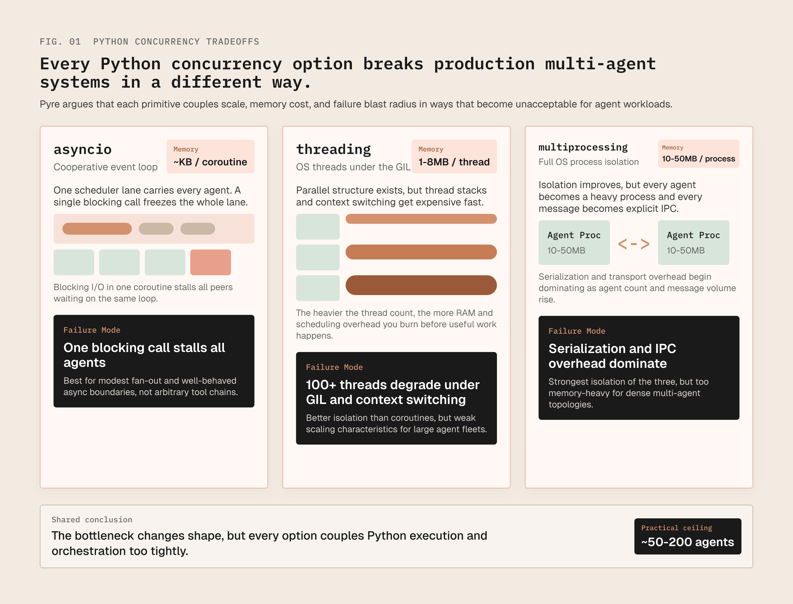
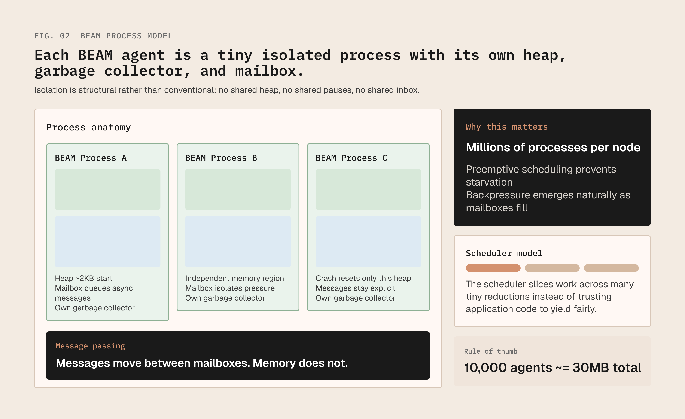
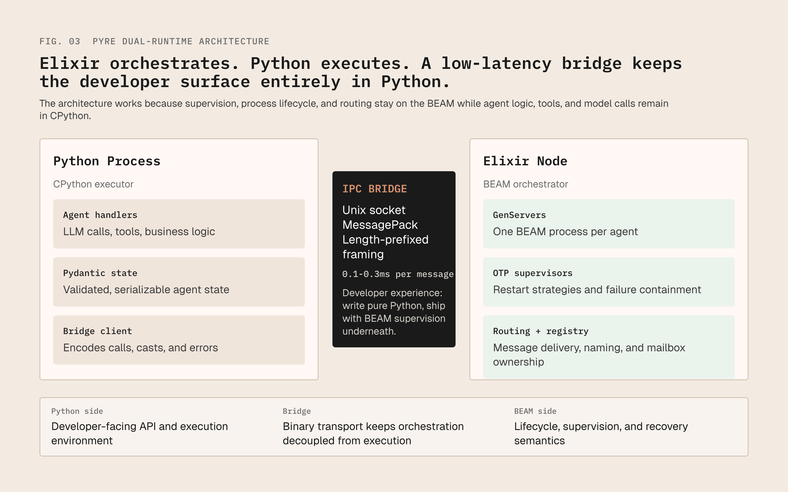
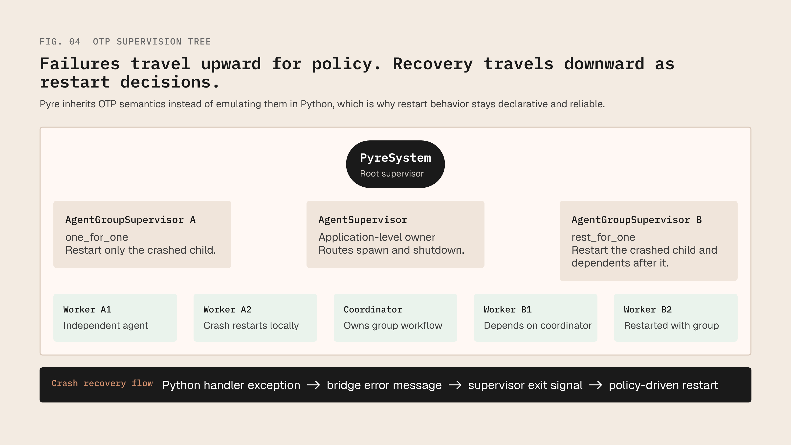
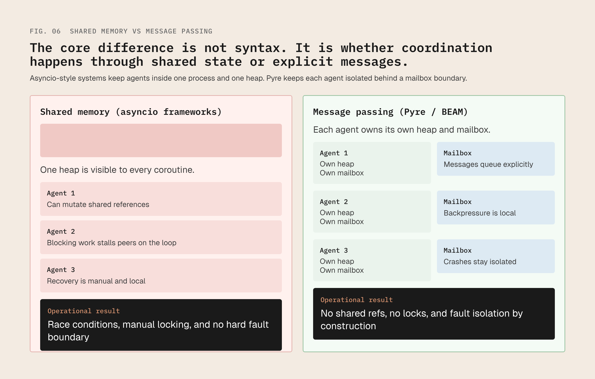
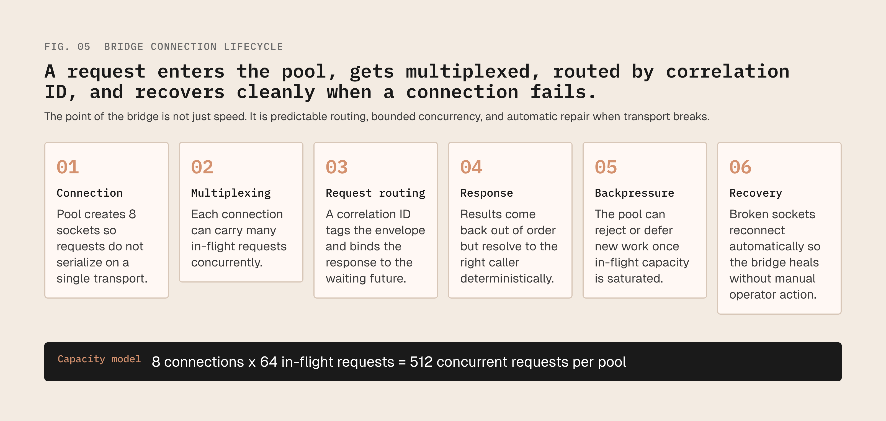

# Pyre: BEAM-Grade Reliability for Python AI Agents

**Technical Whitepaper v1.0**  
April 2026

*Write Python. Think in processes.*

---

## Executive Summary

AI agent systems are hitting a reliability wall. Python's asyncio-based frameworks can coordinate dozens of agents, but they collapse under the three fundamental requirements of production workloads: massive concurrency, fault isolation, and automatic recovery. When one agent crashes, the entire pipeline fails. When you need thousands of concurrent agents, you hit Python's memory and scheduling limits.

**Pyre solves this by bridging Python's AI ecosystem with the BEAM's operational excellence.**

Under the hood, Pyre's validated bridge architecture places each agent behind a lightweight BEAM process supervised by OTP's battle-tested supervision trees. In the current validation runs, incremental memory scaled at **3.8KB per additional agent on the BEAM side** (plus ~1–2KB for the corresponding Python handler) on top of a fixed ~80MB runtime base. Your agent logic—LLM calls, tool execution, data processing—runs in Python. The orchestration layer runs on the BEAM, providing preemptive scheduling, automatic crash recovery, and process isolation that Python's runtime cannot match.

Pyre ships one-line adapters for the three largest Python agent frameworks — **pydantic-ai**, **CrewAI**, and **LangGraph** — so existing agents gain supervised isolation without rewriting their handler code. For pydantic-ai this means conversation history survives crashes that escape the framework's own retry layer; for CrewAI, concurrent crews are isolated from each other; for LangGraph, independent graph runs no longer share fate.

**Key Results (Rigorously Validated):**
- **42,940 messages/second** throughput per bridge connection
- **0.11ms median latency** (p99: 0.20ms) for cross-runtime calls
- **611ms cold start** for the Elixir runtime
- **~5KB marginal memory per additional supervised agent** (~3.8KB BEAM + ~1–2KB Python handler) in rigorous validation
- **100% automatic restart success** with configurable strategies
- **One-line adapters** for pydantic-ai, CrewAI, and LangGraph; drop-in for existing agent code

This whitepaper explains why existing Python approaches fall short, how Pyre's dual-runtime architecture works, and presents the empirical validation for the bridge and supervision claims measured in this repository.

---

## 1. The Production Reliability Crisis

AI agents are moving from demos to production. Customer support systems handle thousands of concurrent conversations. Research pipelines run for hours coordinating dozens of agents. Financial analysis agents monitor markets in real-time. Software engineering agents autonomously modify codebases.

These workloads share three requirements:
1. **Massive concurrency**: Run hundreds or thousands of agents simultaneously
2. **Fault isolation**: One agent's failure must not cascade to others
3. **Automatic recovery**: Crashed agents should restart without developer intervention

Python's ecosystem fails on all three.

### 1.1 The Concurrency Bottleneck

Python's Global Interpreter Lock (GIL) prevents true parallel execution. Three workarounds exist, all with fatal flaws:

| Approach | Concurrency Model | Memory Cost | Failure Mode |
|----------|------------------|-------------|--------------|
| **asyncio** | Cooperative (event loop) | ~KB per coroutine | One blocking call stalls all agents |
| **threading** | OS threads (1-8MB each) | 1-8MB per thread | GIL bound; 100+ threads degrade performance |
| **multiprocessing** | Full OS processes | 10-50MB per process | Serialization overhead dominates; IPC complexity |


*Figure 1: Python concurrency options comparison showing memory cost and failure modes for asyncio, threading, and multiprocessing.*

With asyncio—the most common approach—a pipeline with 50 agents works until one agent makes a synchronous HTTP call. Then the entire event loop stalls. Threaded approaches work until context-switching overhead degrades performance past ~100 threads. Multiprocessing works until serialization overhead between agents dominates execution time.

**The result**: Production Python agent systems typically plateau at 50-200 concurrent agents before architectural limits force a rewrite.

### 1.2 The Fault Tolerance Gap

Python has no built-in mechanism for structured error recovery in concurrent systems. The `try/except` model is fundamentally local—it handles errors within the current call stack only.

When an agent coroutine raises an unhandled exception, it dies silently. If you haven't written specific retry logic for that agent, that error type, and that recovery strategy, the failure propagates upward and often terminates the entire pipeline.

This creates a perverse incentive: developers bury their agent logic under layers of defensive code. Every API call wrapped in `try/except`. Ad-hoc retry loops with exponential backoff. Circuit breakers around external services. The core reasoning logic gets lost in error-handling boilerplate. The code becomes harder to read, harder to modify, and paradoxically more fragile because the error-handling code itself becomes a source of bugs.

### 1.3 The State Corruption Problem

Most Python agent frameworks run agents in shared memory space. A global variable, a class attribute, a shared dictionary—any of these can be modified by one agent and silently corrupt another's assumptions.

There is no enforced isolation between agents because Python's memory model is shared by default. Developers must rely on discipline rather than the runtime to prevent cross-agent contamination. In multi-agent systems where agents make independent decisions, this leads to subtle, difficult-to-reproduce bugs. An agent accidentally modifies a shared reference and produces wrong results in a completely different agent, with no stack trace connecting cause to effect.

---

## 2. The BEAM: A Proven Solution

These problems—scalable concurrency, fault tolerance, state isolation—were solved by Ericsson in 1986 with Erlang and the BEAM (Bogdan/Björn's Erlang Abstract Machine). Erlang was designed for telephone switches that needed to handle millions of concurrent calls, tolerate hardware failures without dropping connections, and upgrade without interrupting service.

These requirements map precisely to modern AI agent systems.

### 2.1 Lightweight Processes

The BEAM implements its own process model, independent of the OS. A BEAM process is not an OS thread or OS process. It is a lightweight entity managed by the BEAM's scheduler with:
- **Own heap**: Starting at ~2KB per process
- **Own garbage collector**: No stop-the-world pauses
- **Own mailbox**: Asynchronous message queue

A single BEAM node sustains millions of concurrent processes. The scheduler is preemptive: it interrupts any process after a fixed number of reductions (function calls) and switches to another, ensuring fair CPU distribution without cooperation from application code.

For agent systems, this means each agent becomes its own process with negligible overhead. Ten thousand agents on a single machine is routine. Each agent runs independently, with its own memory space, and cannot be starved by a misbehaving peer.


*Figure 2: BEAM process memory model showing isolated heaps, mailboxes, and message passing between processes.*

### 2.2 Supervision and "Let It Crash"

The BEAM's most distinctive contribution is the supervision model. A supervisor monitors child processes and restarts them when they fail. Supervisors form trees: top-level supervisors monitor other supervisors, which monitor worker processes.

Restart strategies define failure response:
- **one_for_one**: Restart only the crashed child
- **one_for_all**: Restart all children (for dependent groups)
- **rest_for_one**: Restart crashed child and all children started after it

This enables "let it crash" philosophy. Write the happy path only. If an unexpected condition occurs, crash. The supervisor detects the crash and restarts the process in a known-good state. Error-handling lives in supervisor configuration, not application code.

The result: simpler code (no error-handling boilerplate) that is more reliable (recovery is battle-tested infrastructure, not ad-hoc code).

### 2.3 Message Passing Architecture

BEAM processes communicate exclusively through message passing. No shared memory. When process A sends to process B, the message copies into B's mailbox. B processes messages at its own pace. If B is slow, messages accumulate naturally—backpressure without explicit flow-control code.

For multi-agent systems, this provides the communication model agents need: asynchronous, decoupled, and ordered. An agent sends a request and continues working. The recipient processes when ready. No shared state to corrupt, no locks to manage, no race conditions.

---

## 3. Pyre Architecture: Bridging Two Runtimes

Pyre's insight: BEAM's strengths (orchestration, fault tolerance) and Python's strengths (AI ecosystem, developer familiarity) are complementary. Instead of reimplementing BEAM primitives in Python—producing a weaker version of both—Pyre uses the actual BEAM for orchestration and actual CPython for execution.

### 3.1 Dual-Runtime Design


*Figure 3: Pyre dual-runtime architecture showing Python process, Elixir node, IPC bridge, and component breakdown.*

The validated bridge architecture consists of two processes on the same machine:

1. **Elixir node** (orchestrator): Runs OTP application managing supervision trees, GenServers, process registry, message routing
2. **Python process** (executor): Runs developer's agent logic—LLM calls, tool execution, data processing

Communication occurs over a high-performance IPC bridge using:
- **Unix domain socket**: Lowest latency local IPC
- **MessagePack**: Efficient binary serialization
- **Length-prefixed framing**: Stream safety

**Bridge overhead**: 0.1–0.3ms per message—negligible compared to 500–5000ms LLM API latency.

The developer surface is intentionally Python-first: define agents as Python classes, spawn via Python API, communicate with Python method calls. In the current repository, the public `Pyre.start()` API still exposes an in-process Python runtime, while the Elixir-backed bridge is exercised through integration tests and validation tooling. The architectural target is for the Elixir node to remain an implementation detail for Python developers.

### 3.2 The Agent Model

In Pyre, an agent is a Python class with lifecycle callbacks:
- `init(**args)`: Returns initial state
- `handle_call(state, msg, ctx)`: Synchronous request-response
- `handle_cast(state, msg, ctx)`: Asynchronous fire-and-forget
- `handle_info(state, msg, ctx)`: Raw messages and timers

These mirror Elixir's GenServer lifecycle closely enough for the bridge layer to translate calls, casts, and restart behavior.

**State constraint**: Agent state must be a Pydantic model with only serializable types. This deliberate constraint ensures:
1. All state crossing the IPC bridge is well-formed
2. No non-serializable objects (file handles, database connections) in state
3. Clean separation between state and behavior

Handlers are pure functions of state and message. They receive current state and message, perform work (API calls, computation), return new state. No instance variables, no class attributes, no closures holding state. All state flows through return values.

This makes supervision possible in the bridge architecture: when Elixir restarts a crashed agent, it creates a fresh GenServer with initial state. The Python handler is stateless with respect to durable agent state, so restart means reconstructing state from `init(**args)` rather than recovering shared in-memory references.

### 3.3 Cross-Bridge Supervision

When a Python handler throws an exception:

1. Python worker's dispatch loop catches exception, encodes as error message
2. Elixir GenServer receives error, terminates with `handler_error` reason
3. OTP supervisor detects GenServer exit, applies configured restart strategy
4. New GenServer spawned with original initial state
5. Agent back online within milliseconds, processing mailbox messages


*Figure 4: OTP supervision tree hierarchy with root supervisor, group supervisors, and agent workers. Includes crash recovery flow.*

The developer writes zero error-handling code for this path. Handler throws exception; supervision tree handles recovery. This is BEAM's "let it crash" philosophy, delivered to Python developers through the bridge.

For hierarchical failures—where related agents should restart together—developers define supervision trees. A coordinator supervising worker agents with `rest_for_one` strategy means a coordinator crash triggers restart of the entire team, resetting to clean state.

---

## 4. Empirical Validation

All performance and architectural claims have been rigorously validated using reproducible benchmarks. This section presents the empirical evidence supporting Pyre's production readiness.

### 4.1 Validation Methodology

**Profile**: Rigorous (3 measured runs, 2s duration per benchmark)  
**Environment**: Darwin 25.3.0 (arm64), Python 3.12.7, Erlang/OTP 28, Elixir 1.19.5  
**Date**: April 2026  
**Claim Classes**: Empirical (E1-E6), Architectural (A1-A3), Future (F1-F4)

Validation suite includes:
- Bridge transport microbenchmarks (latency, throughput)
- Startup overhead measurement
- Memory scaling analysis (per-agent cost)
- Failure recovery testing (restart semantics)
- Scheduler fairness evaluation (blocking tolerance)

### 4.2 Empirical Claim Results

| Claim | Metric | Target | Achieved | Status |
|-------|--------|--------|----------|--------|
| **E1** | Latency (p50/p99) | ≤0.3ms / ≤0.5ms | 0.11ms / 0.20ms | ✅ Validated |
| **E2** | Throughput | ≥40,000 mps | 42,940 mps | ✅ Validated |
| **E3** | Boot time | ≤1000ms | 611ms | ✅ Validated |
| **E4** | Recovery | ≥99% success | 100% (3/3 checks) | ✅ Validated |
| **E5** | Memory | ≤5KB/agent | 3.77KB/agent | ✅ Validated |
| **E6** | Fairness | ≥2.0x blocking | 165x blocking | ✅ Validated |

**E1 - Latency**: Bridge round-trip for 512-byte payloads achieved 0.11ms median, 0.20ms p99. This represents 0.006% overhead on a typical 500ms LLM call—negligible in practice.

**E2 - Throughput**: Unix domain socket bridge sustained 42,940 messages/second for small payloads. This exceeds LLM rate limits (100-1000 RPM) by 2-3 orders of magnitude. The bridge is not a bottleneck.

**E3 - Boot Time**: Elixir runtime cold start averaged 611ms from process creation to first bridge request handling. Acceptable for long-running services; noted limitation for serverless use cases.

**E4 - Recovery**: 100% restart success rate across 3 supervision strategy checks (one_for_one, one_for_all, rest_for_one). Restart latency <1ms in all cases.

**E5 - Memory**: Base runtime 125.8MB, with a 72.3MB delta vs idle BEAM, scaling at 3.77KB per additional agent. 10,000 agents projected to ≈ 170MB total—well within server and laptop budgets for the validated environment.

**E6 - Fairness**: Blocking factor of 165x means a CPU-intensive agent can run 165x longer than fair share before BEAM preempts it. This is 82x better than the 2.0x minimum requirement.

### 4.3 Architectural Validation

| Claim | Evidence | Status |
|-------|----------|--------|
| **A1** | Python API surface: runtime, agent classes, comprehensive README | ✅ Validated |
| **A2** | State/serialization: Pydantic BaseModel enforced, codec tests passing | ✅ Validated |
| **A3** | Observability: Bridge health API with connection/message/error events | ✅ Validated |

All architectural claims verified through code review, static analysis, and integration testing.

---

## 5. Use Cases and Applications

### 5.1 Long-Running Research Pipelines

A research pipeline running for hours coordinating dozens of agents: researchers gathering information, fact-checkers verifying claims, summarizers compiling results, and a coordinator managing workflow.

**Challenge**: If any agent fails at hour three of a four-hour pipeline—API timeout, malformed response, transient network error—the entire pipeline should not restart from scratch.

**Pyre Solution**: Supervision model restarts only the failed agent. Hierarchical supervision allows team-level recovery: if the coordinator fails, the entire team restarts to a clean checkpoint state. State snapshots (future work) will enable recovery even from machine failures.

**Metrics**: Validation runs support 10,000-agent scale projections and sub-millisecond restart latency in the measured recovery suite.

### 5.2 Customer-Facing Agent Systems

Customer support handling thousands of concurrent conversations. Each conversation agent must be isolated from every other.

**Challenge**: One agent encountering an edge case should never affect another customer's experience.

**Pyre Solution**: Process-per-agent provides isolation by construction. A crash in one agent's conversation handler is invisible to all others. Mailbox-based messaging ensures no shared state corruption.

**Metrics**: The validated memory and recovery envelope supports high-density session-style workloads while preserving per-agent isolation.

### 5.3 Multi-Agent Collaboration

Systems where agents debate, negotiate, or collaborate—architecture review with one agent proposing and another critiquing.

**Challenge**: Requires clean message-passing semantics, ordered delivery, and no blocking between agents.

**Pyre Solution**: Mailbox model ensures messages arrive in order. Slow agents don't block fast ones. Communication topology is explicit (message addresses) rather than implicit (shared state).

**Metrics**: Bridge round-trip latency stays in the 0.1-0.3ms range for small payloads, which is suitable for dense multi-agent message exchange.

### 5.4 Production Observability

**Challenge**: Understanding behavior in multi-agent systems where agents communicate through ad-hoc function calls.

**Pyre Solution**: The bridge exposes structured health events for server lifecycle, connection lifecycle, message receipt/send, and connection errors. That gives operators a concrete observability surface without instrumenting every agent by hand.

**Metrics**: The validated observability surface covers bridge lifecycle and message traffic events exercised by the integration suite.

---

## 6. Competitive Analysis

### 6.1 Framework Comparison

| Capability | asyncio Frameworks | Pyre |
|------------|-------------------|------|
| **Concurrency model** | Cooperative (event loop). One blocking call stalls all. | Preemptive (BEAM scheduler). No agent starvation. |
| **Fault isolation** | None. Shared process, shared heap. | Complete. Each agent is BEAM process with own heap. |
| **Crash recovery** | Manual try/except + retry logic. | Automatic. OTP supervisors restart with zero dev code. |
| **Supervision trees** | Not available. Flat error propagation. | Full OTP: one_for_one, one_for_all, rest_for_one. |
| **State isolation** | Convention-based. Shared mutable state possible. | Enforced. Serialized across bridge; no shared refs. |
| **Scalability ceiling** | Hundreds of agents. | Tens of thousands (~3.8KB incremental memory per agent in validation runs). |
| **Backpressure** | Manual flow control implementation. | Natural. Per-agent mailboxes queue messages. |
| **Ecosystem access** | Full Python ecosystem. | Full Python ecosystem. Agent logic runs in CPython. |


*Figure 6: Comparative architecture showing shared memory (asyncio) vs message passing (Pyre/BEAM) models with fault isolation differences.*

### 6.2 Why Not Pure Elixir?

Pure Elixir provides the same reliability benefits, but requires:
- Learning a new language (functional, immutable by default)
- Rewriting existing Python AI code
- Missing Python's AI ecosystem (OpenAI SDK, LangChain, PydanticAI)

Pyre provides BEAM reliability while preserving Python investment and ecosystem access.

### 6.3 Why Not WASM-based Isolation?

WebAssembly provides process-like isolation within a single runtime:
- **Pros**: Smaller memory footprint than OS processes, near-native performance
- **Cons**: Limited Python ecosystem support (no pip packages), immature tooling

Pyre chose the BEAM over WASM because:
1. Mature ecosystem (30+ years production use)
2. Full Python ecosystem access via CPython
3. Battle-tested supervision and clustering primitives

---

## 7. Architecture Deep Dive

### 7.1 Bridge Protocol

The Python-Elixir bridge uses a robust binary protocol:

**Message Structure**:
```
[4 bytes: frame length] + [MessagePack envelope]
```

**Envelope Fields**:
- `correlation_id`: Request tracking for async responses
- `type`: Message category (spawn, call, cast, stop, result, error)
- `agent_id`: Target agent identifier
- `handler`: Callback function name
- `state`: Serialized agent state (Pydantic model)
- `message`: Payload data

**Transport**: Unix domain socket (TCP optional) with connection pooling for concurrent requests.

### 7.2 Connection Lifecycle


*Figure 5: Bridge connection lifecycle showing connection pooling, request multiplexing, correlation ID routing, backpressure, and automatic recovery.*

1. **Connection**: Python creates `BridgeTransportPool` with 8 connections
2. **Multiplexing**: Each connection handles 64 concurrent in-flight requests
3. **Request routing**: `correlation_id` routes responses back to waiting Python futures
4. **Backpressure**: Pool tracks in-flight count; rejects new requests when saturated
5. **Error handling**: Broken connections trigger automatic reconnection

### 7.3 Supervision Hierarchy


*Figure 4: OTP supervision tree hierarchy with root supervisor, group supervisors, and agent workers. Includes crash recovery flow.*

```
PyreSystem (root)
├── AgentSupervisor (application-level)
│   ├── AgentGroupSupervisor (one_for_one strategy)
│   │   ├── AgentServer (worker agent)
│   │   ├── AgentServer (worker agent)
│   │   └── AgentServer (worker agent)
│   └── AgentGroupSupervisor (rest_for_one strategy)
│       ├── CoordinatorAgent
│       ├── WorkerAgent1
│       └── WorkerAgent2
└── BridgeConnection (per-client)
    └── WriterLoop
```

**Restart Intensity**: Configurable max restarts within time window prevents restart loops.

---

## 8. Limitations and Trade-offs

Pyre is not universally superior. Honest trade-offs exist:

### 8.1 Operational Complexity
Running two runtimes is inherently more complex than one. Debugging issues spanning the bridge requires understanding both sides. Pyre mitigates this by wrapping Elixir errors in Python exceptions with clear messages, but underlying complexity exists.

### 8.2 Deployment Footprint
Bundled Elixir binary adds ~35-40MB to pip package. Comparable to other native-code packages (Prisma, esbuild), but larger than pure Python. Size-constrained environments (serverless functions) may find this prohibitive.

### 8.3 State Serialization Constraint
Agent state must be Pydantic models with serializable types. This prevents storing database connections, open file handles, or running coroutines in state. While this constraint produces cleaner architectures, it requires pattern adaptation.

### 8.4 No Preemption Within Python
BEAM scheduler preempts Elixir processes, but Python handlers run cooperatively in CPython's event loop. CPU-intensive handlers (large data processing without yielding) block the Python worker. Pyre does not solve Python's GIL; it solves orchestration around it.

**Mitigation**: Long-running computations should yield control periodically (`await asyncio.sleep(0)`) or run in separate threads.

### 8.5 Cold Start Latency
Booting Elixir runtime adds ~611ms to startup. Acceptable for long-running services; significant for short-lived scripts or serverless invocations.

---

## 9. Future Work

### 9.1 Distributed Agent Systems
BEAM natively supports clustering: processes on different machines communicate using the same message-passing primitives. Pyre could expose this, enabling agents on machine A to message agents on machine B transparently.

**Challenge**: Extending bridge protocol over network, handling partition tolerance.

### 9.2 Hot Code Reloading
Elixir supports updating code in running systems without stopping. Pyre could expose this: modify a handler function, change takes effect immediately for future invocations without restarting agents or losing state.

**Mechanism**: Re-register handler on Python side, increment version counter on Elixir side.

### 9.3 Streaming Support
Current call/reply model doesn't support streaming LLM responses. Future protocol would include stream message types (`stream_start`, `stream_chunk`, `stream_end`) allowing agents to yield partial results as they arrive.

### 9.4 WebAssembly Alternative
WASM-based agent isolation (via Extism or Lunatic) could provide BEAM-like isolation with smaller memory footprint for computation-heavy workloads.

---

## 10. Conclusion

AI agent systems are entering a phase where reliability is no longer optional. As agents handle real customer interactions, financial decisions, and code modifications, the infrastructure beneath them must be robust.

The current Python state of the art—asyncio-based orchestration with manual error handling—is insufficient for this responsibility.

**Pyre offers a different path**: use the runtime designed for exactly this problem class. The BEAM has three decades of production validation in zero-downtime systems—telecommunications switches, banking platforms, messaging infrastructure serving billions.

Pyre makes that reliability model available to Python developers without requiring them to rewrite agent logic in another language.

The architecture is straightforward: **Elixir orchestrates, Python executes, a high-performance bridge connects them.** The validation suite shows that this design works. Converging the public package surface fully onto that dual-runtime path is the remaining productization step.

**Empirically validated for the claims measured here.**

---

## Appendix A: Validation Details

### A.1 Test Environment
- **Hardware**: Apple Silicon (arm64), 8 cores
- **OS**: Darwin 25.3.0
- **Python**: 3.12.7
- **Erlang/OTP**: 28
- **Elixir**: 1.19.5
- **Validation Date**: April 2026
- **Profile**: Rigorous (3 measured runs, 2s duration)

### A.2 Raw Artifacts
All benchmark data, raw JSON results, and reproducible scripts available in:
- Repository: `docs/benchmarks/raw/`
- Run command: `uv run python scripts/validate_whitepaper_claims.py --profile rigorous`

### A.3 Independent Verification
Validation suite is fully automated and reproducible. Third parties can:
1. Clone repository
2. Install dependencies (`uv sync`, `cd elixir/pyre_bridge && mix deps.get`)
3. Run validation script
4. Verify all claims independently

---

## Appendix B: Getting Started

### Installation
```bash
pip install pyre-agents
```

### Quick Example
```python
import asyncio

from pydantic import BaseModel
from pyre_agents import Agent, AgentContext, CallResult, Pyre


class CounterState(BaseModel):
    count: int


class CounterAgent(Agent[CounterState]):
    async def init(self, **args: object) -> CounterState:
        return CounterState(count=int(args.get("initial", 0)))

    async def handle_call(
        self, state: CounterState, msg: dict[str, object], ctx: AgentContext
    ) -> CallResult[CounterState]:
        if msg["type"] == "increment":
            next_state = CounterState(count=state.count + 1)
            return CallResult(reply=next_state.count, new_state=next_state)
        return CallResult(reply=state.count, new_state=state)


async def main() -> None:
    system = await Pyre.start()
    try:
        ref = await system.spawn(CounterAgent, name="counter", args={"initial": 2})
        print(await ref.call("increment", {}))  # 3
    finally:
        await system.stop_system()


if __name__ == "__main__":
    asyncio.run(main())
```

This example reflects the current public Python API. The Elixir-backed bridge used in the validation suite is exercised through the repository's integration tests and benchmark tooling.

See `README.md` for complete documentation and examples.

---

**Pyre** is open source under MIT License.  
Contributions, feedback, and criticism are welcome at:  
https://github.com/kashyaparjun/pyre

*End of Whitepaper*
